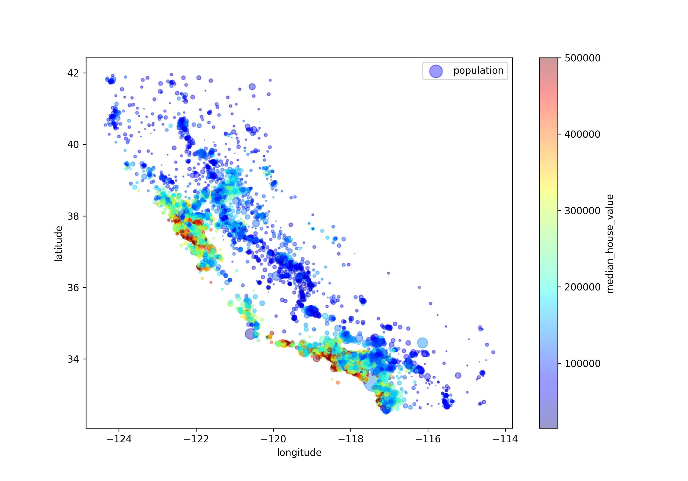
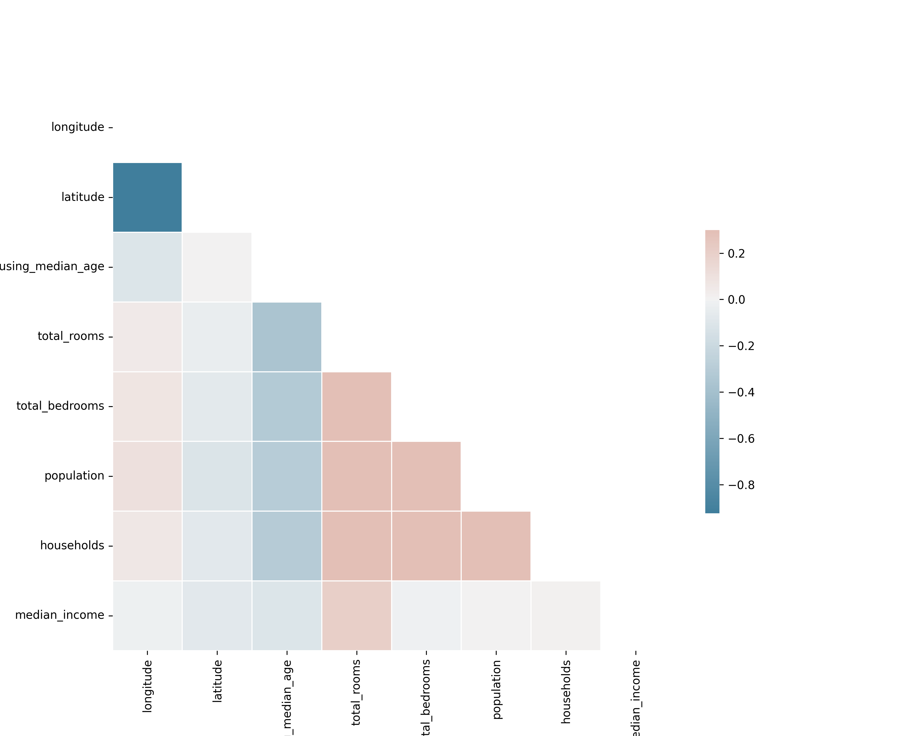

# 🏠 California Housing Price Prediction

This project focuses on building a predictive model to estimate the median house value in California districts. It covers the entire machine learning workflow from data cleaning to model evaluation.

## 📍 Project Overview
Using the California Census data, I performed:
1. **Stratified Sampling:** To maintain the distribution of income categories in both train and test sets.
2. **Exploratory Data Analysis (EDA):** Visualized geographical distribution and correlations.
3. **Data Preprocessing:** Built a pipeline for missing value imputation, one-hot encoding, and feature scaling.
4. **Model Performance:** Compared Linear Regression, Decision Trees, and Random Forest.

## 📊 Key Visualizations
### 1. Housing Prices Map
 
*This plot shows that house prices are heavily influenced by location (coastal areas) and population density.*

### 2. Correlation Matrix

*Median income showed the strongest positive correlation with house prices.*

## 🛠️ Tech Stack
- **Language:** Python
- **Libraries:** Pandas, NumPy, Scikit-Learn, Matplotlib, Seaborn

## 📈 Results
The **Random Forest Regressor** achieved the lowest RMSE of 18790.335043, outperforming other models after 10-fold cross-validation.
